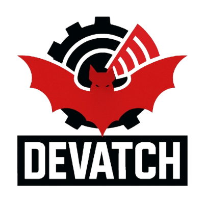

https://imgbb.com/
# Devatch
Devatch is a multi tool meant to testing and what ever you plan to use it for
> DO NOTE we are not responsible for anything you do with Devatch and or use Devatch for whether it be legal or illegal we are unsure what illegal things you would do with this but to cover our ass we will put that in here and if you use it for bad acting also known as just using it for evil and such we are not responsible for anything that happens or is caused by this tool YOU are responsible for anything that happens or is caused when using this tool
update logs are handled in the bat file but also are not really logged the bast seeing ill make small small changes or just forget so feel free to check the chnages github shows

something else is that we need more devs as im dumb as hell and hardly know anything other then making a tool from hell (this shit is ass)
also its a side project so updates may be fast and slow no real updates every 2 weeks type thing also its free so yea

this multi took has other batch tools i find that i think would be nice to have all in 1 place and i will do my best to give credits to the makers of the few batch files i didnt make that are added
